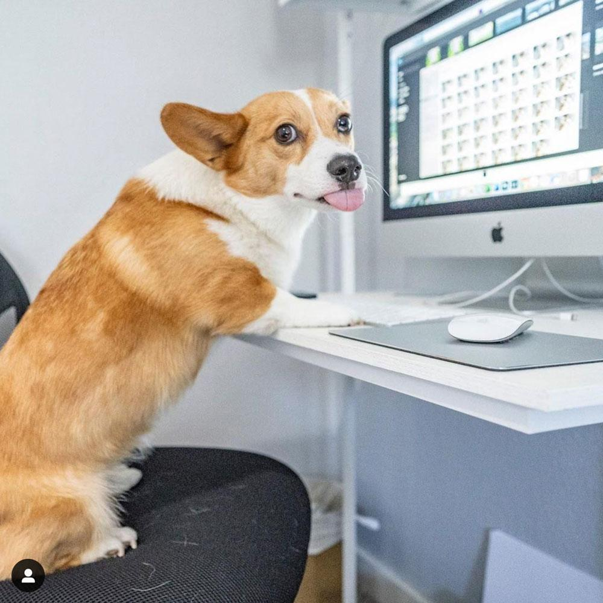

# info2180-lab1

<!DOCTYPE html>
<html lang="en">
<head>
    <meta charset="UTF-8">
    <meta name="viewport" content="width=devicewidth, initial-scale=1.0">
    <meta http-equiv="X-UA-Compatible" content="ie=edge">
    <title>INFO2180 Lab 1</title>
    <link rel="stylesheet" type="text/css" href="styles.css.md" />
</head>
<body>
 <header>
     <h1>INFO2180 Lab 1</h1>
     
This is a simple webpage for Lab 1 of INFO2180.

 </header>
 <main>
 <h2>[Sudhish Sepaul]</h2>
 
[My name is Sudhish Sepaul. I am currently a second year Computer Science student at the University of the West Indies, Mona. 
	In my free time i like to play video games with friends and watching twitch.  ]

 

 </main>
 <footer>
 
Copyright &copy; 2020 <Sudhish Sepaul>.

 </footer>
</body>
</html>
